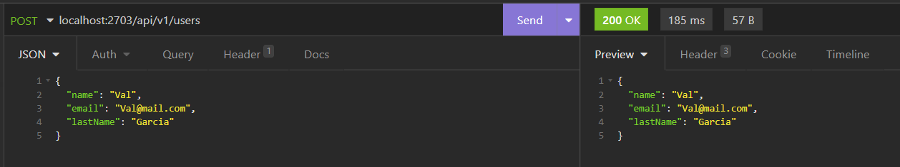
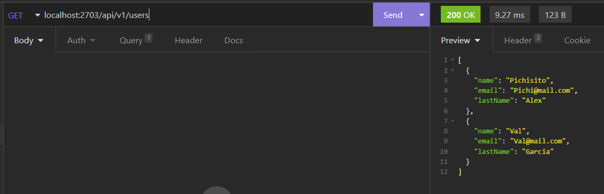
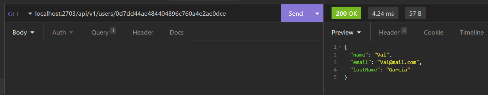
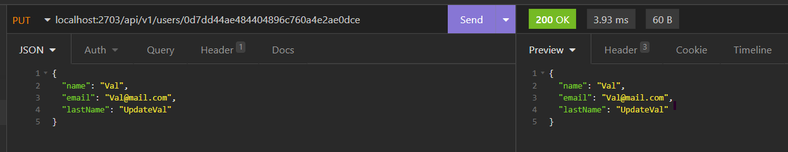
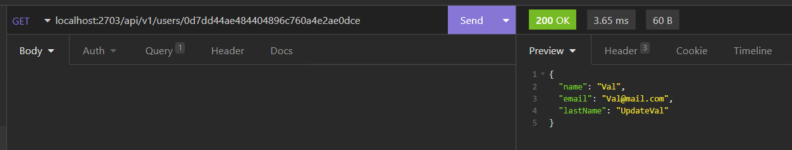
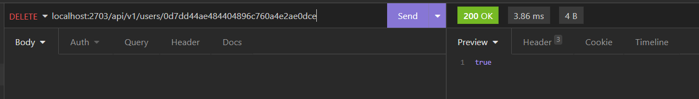

# IETI-TaskPlanner-Users

User microservice created using Spring Boot

## Test User Service 

### Crete User - POST 

### Get all Users - GET

### Get User by Id - GET

### Update user - PUT 

#### Check user Update

### Delete User - DELETE

#### Check user delete

