# IETI-TaskPlanner-Users

User microservice created using Spring Boot with MongoDB as database

## Test User Service Mongo

### Crete User - POST 

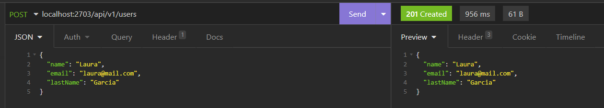

#### User MongoDB 

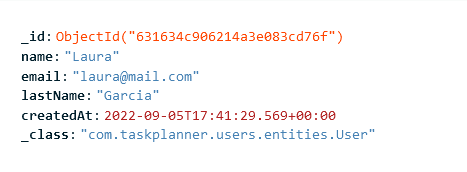

### Get all Users - GET

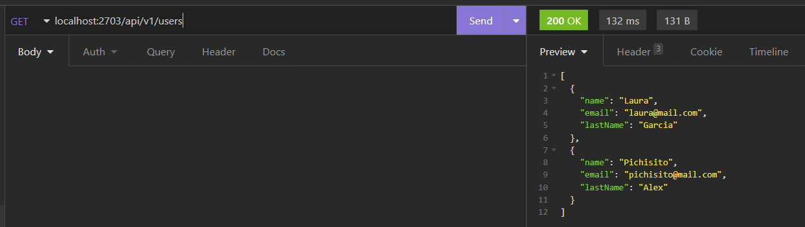

### Get User by Id - GET

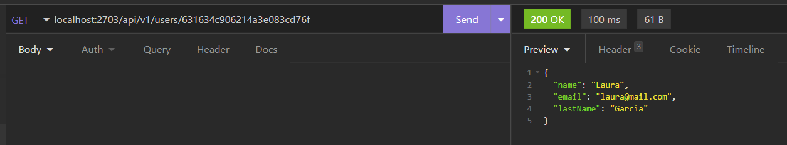

### Update user - PUT 

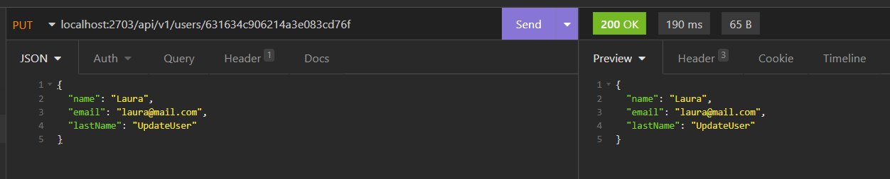

#### Check user Update

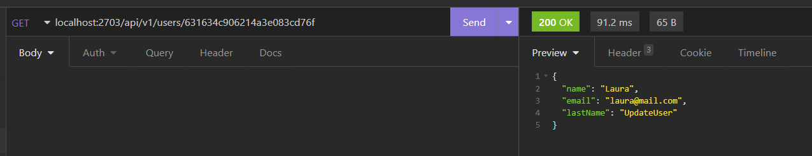

### Delete User - DELETE

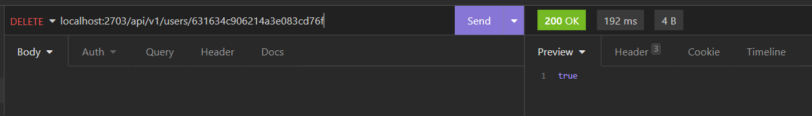

#### Check user delete

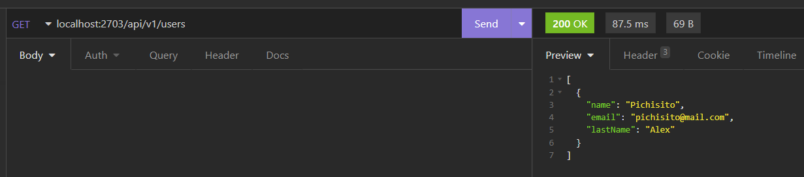

### Get users created after date

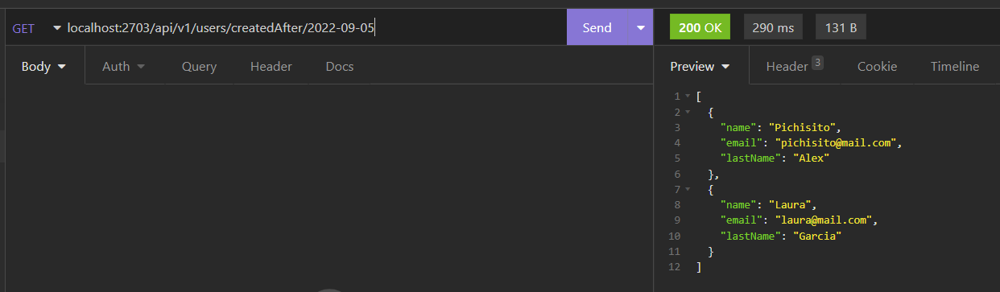

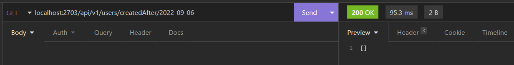

### Get users like pattern

#### Get users whose name like pattern

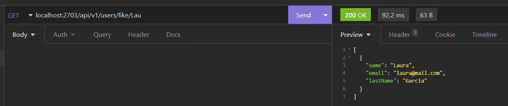

#### Get users whose last name like pattern

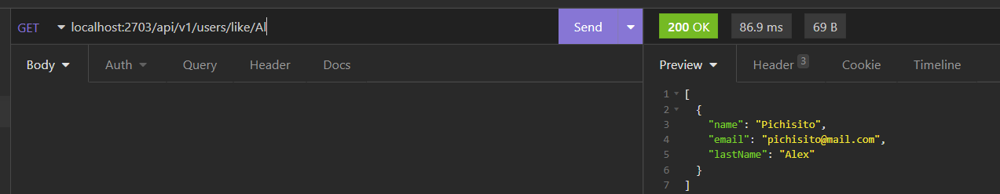

