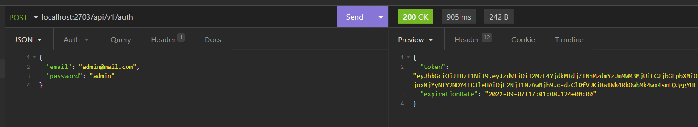

# IETI-TaskPlanner-Users

User microservice created using Spring Boot with MongoDB as database and JWT as Token creator 

## Test User Service using token 

### Implement the Authentication Controller
### Open endpoint 

### Secured endpoint

### Implement JWT Request Filter
#### Login user and get Token

#### Get all Users using Bearer Token 

#### Get all Users without using Bearer Token

